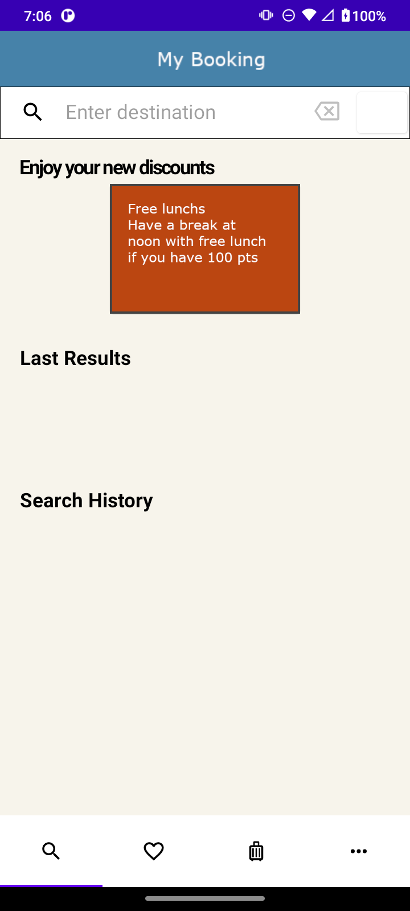
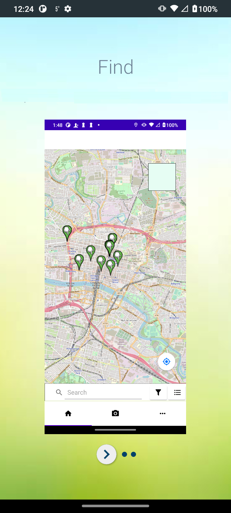
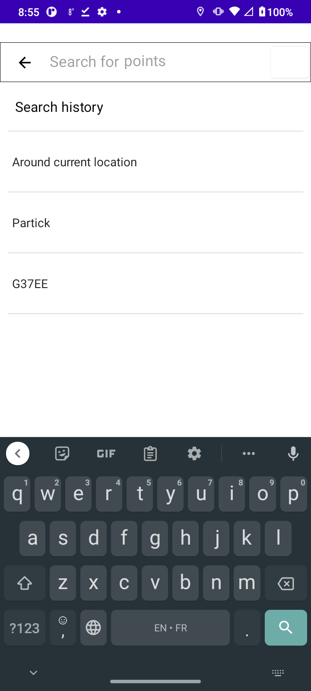
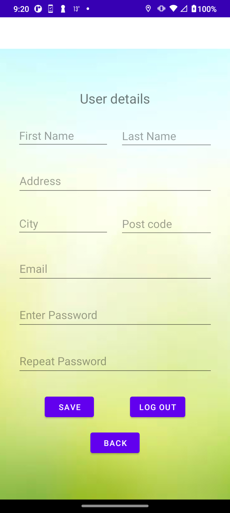
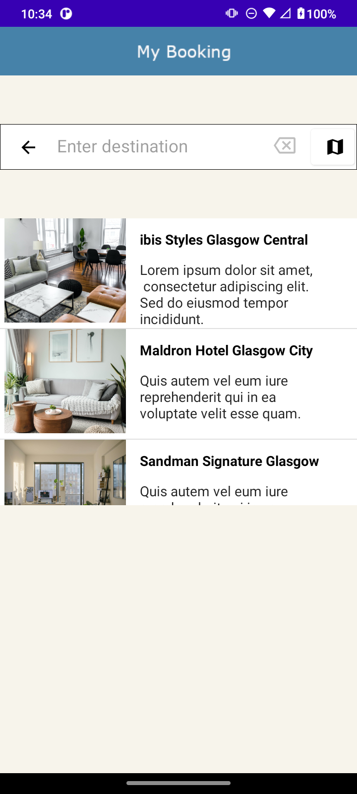

# AndroidBooking
An Android app reusing my homemade Java and Kotlin framework AndroidJavaTools: https://github.com/mathieudelehaye/AndroidJavaTools

This is a clone of an online travel agency app, like [Booking.com](https://www.booking.com). 

  
  

  
  

  
  

  

